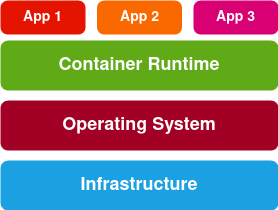
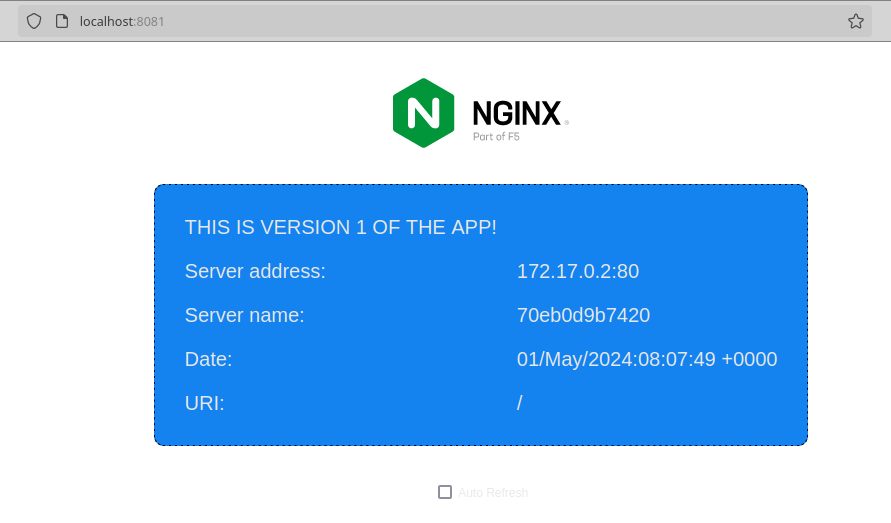

# The building blocks of the modern world

We all heard about containers, and we probably know they are everywhere. I like how the tech industry took the idea of the container.
I read somewhere that the standard shipping container may be considered one of the most important inventions of the modern world.
It allowed for the easier transportation of goods across the oceans, roads and railways. The same happens to the containers we are more familiar with.

I wanted to dedicate my first article in this blog to containers, and my first experiments with it. If we're going to explore Kubernetes,
we need to know something about Docker first. I wanted it to be short and hands-on too.

# An overview of virtualization and containers

In the physical server world, your applications run on a dedicated machine, with its dedicated operating system and all the underlying hardware.

Enter the virtualization technology. Simply put, virtualization is the process to create a software (virtual) version of something physical, be it storage, networking, or compute power. What makes virtualization possible is something called the **hypervisor**. This is a tool that provides an abstraction of a computer's physical resources, and creates a virtualized hardware layer. These resources can now be shared among virtual machines that sit on top of this hypervisor. One physical server can now *host* different virtual machines, called the *guests*. This allows for more *efficiency*, *flexibility*, and *scalability*.

Below is a visual representation of virtualization using a hypervisor. In this image, we see a **type 1 hypervisor**. The hypervisor runs directly on the host's hardware. This one is also called a *bare metal hypervisor*.


In a **type 2 hypervisor**, the hypervisor software runs on a conventional operating system. There's an added layer to the diagram above.

Container virtualization lightens the load even more. While virtual machines run their own operating systems, containers share the operating system with their host system. This is made possible through the **container runtime**. It looks like this.



[Docker](https://www.docker.com/) is one of the pioneers in the container world, and one of the leading companies. There are others too, but due to its huge popularity, when we think of containers, Docker is what usually comes to our minds.

In this article, we'll take a peak at Docker.

# Installing Docker

I'm running [Xubuntu](https://xubuntu.org/) 22.04 in my old and puny Lenovo laptop. As a quick side note, if you have an old laptop
gathering dust in some corner of your house, you might consider installing Xubuntu in it. It's lightweight, it's stable and
I really dig the Xfce desktop environment.

Being said that, the easiest and fastest way to install the Docker engine in a Linux machine is using Snap. This is the command:

`sudo snap install docker`

[Docker Desktop](https://docs.docker.com/desktop/install/linux-install/) is available for Linux, but I wouldn't dare install it
in this machine. Docker Desktop consumes a lot of resources. It has the advantage, though, of the built-in Kubernetes. 

# Images and containers

Docker images are read-only templates used to build containers. They come packaged with the application code, and everything else the application needs to run. The **Dockerfile** (with an uppercase D) is a file with a set of instructions that tells Docker how to build the image. Once you have your Dockerfile ready you run `docker build` to actually build the image.

Containers are simply the images running at runtime.

# Building an image

For this experiment, I grabbed a super simple [NGINX](https://www.nginx.com/) webserver that I took from their [GitHub repository](https://github.com/nginxinc/NGINX-Demos/tree/master/nginx-hello). I tweaked it a little bit, and created 2 different versions. I used these 2 versions for my other experiments with AKS, which I'll share in a while. Here's how they look like.


## Cloning the GitHub repository

I'm hosting the 2 versions of this app in [my GitHub repository](https://github.com/rmiravalles/theapp). Feel free to grab it for your own experiments.

To clone this repository, this is the command you run.

`git clone https://github.com/rmiravalles/theapp`

You'll notice that this repository has 2 branches, **v1** and **v2**. You can see all the branches in the repository by running `git branch -a`.


To switch between branches, you run `git checkout [<branch>]`. Let's move to the branch **v1**.


There's a Dockerfile already in there, so this is ready to be built into an image. This is what it looks like.

```
FROM nginx:mainline-alpine
RUN rm /etc/nginx/conf.d/*
ADD hello.conf /etc/nginx/conf.d/
ADD index.html /usr/share/nginx/html/
EXPOSE 80
```
This file will tell Docker to use the **mainline-alpine** image from Docker Hub. The **RUN** line is a regular Bash command, that will remove whatever content is inside the `/etc/nginx/conf.d/` directory and add the `hello.conf` to it. It then tells Docker to add the `index.html` to the `/usr/share/nginx/html/`. Finally, **EXPOSE** tells Docker to expose port 80 to network requests. Let's build!

`sudo docker build -t theapp:v1 .`

The command above needs to be executed from the folder where all these files live. The `-t` flag is the tag, and the `.` tells Docker to go through the current directory.

To see the image in action, this is the command.

`docker run -d -p 8081:80 theapp:v1`

The `-d` flag tells Docker to remain detached from the container, meaning that we don't want to open a shell session inside the container. The `-p` tells Docker to allow incoming traffic from port 8081 through port 80 in the container.

And this is our container up and running!



If you want to see the existing images, run `sudo docker images`

# Sharing the Docker image with the world

You may want to share your newly built image with your friends and family. There are some options out there, but [Docker Hub](https://hub.docker.com/) is the most popular. Let's upload this one to Docker Hub. First you will need to have an account, obviously.

This is how you login to Docker Hub from the command line.

`docker login`

You may want to search for images too, once you're logged in. Let's search for Nginx images, using the command `docker search`.


The first in the list is the official Nginx image. If you want to use this one, simply run `docker pull nginx`.

To push our image to Docker Hub, you may have guessed that you need the `docker push` command. But before we push it, we need to add an identifying tag, like this.

`docker tag theapp:v1 rmiravalles/theapp:v1`

Now you can run the `docker push` command, adding the tag to it.

`docker push rmiravalles/theapp:v1`

And there's our image!


# There's much much more!

This is just the beginning. There's so much more to containers. I'm just starting too. I need to dive deeper into container networking, and storage. I'm hoping to get to these topics soon.

Please let me know if you have suggestions, or if you've seen something wrong here. This is all a work in progress, and I'm learning as I go.

Thank you for staying with me.


