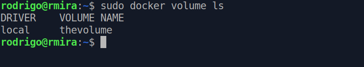
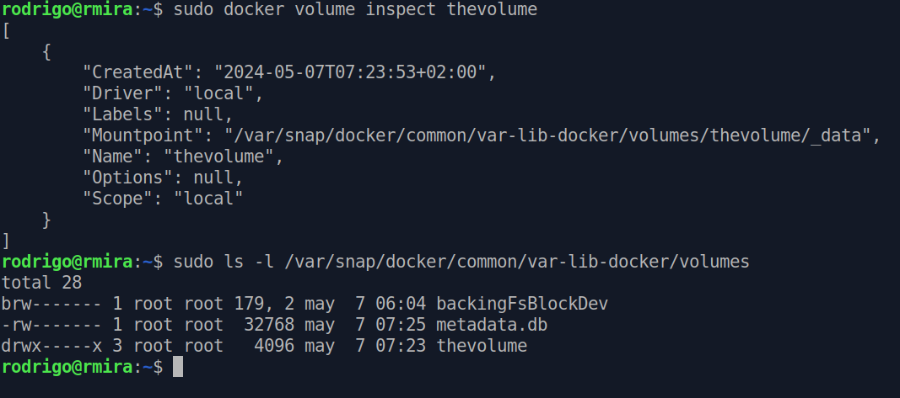
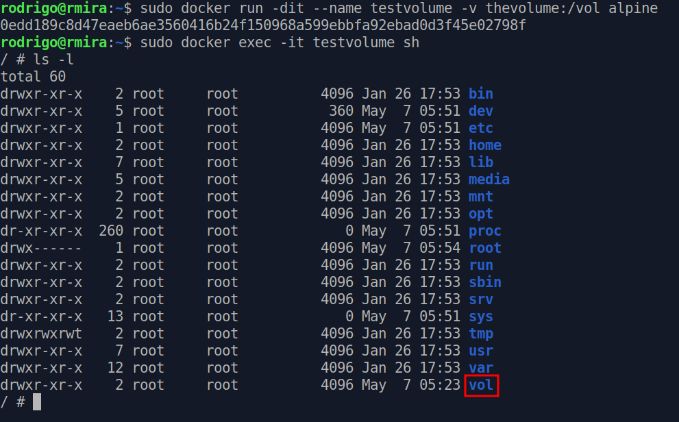
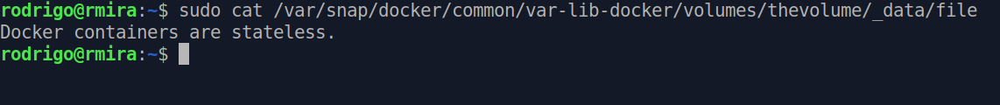

# Containers are ephemeral

Containers have short lives. When they are gone, not a trace is left in the world. Nobody remembers them, as if they never existed. Like an unperson, in George Orwell's 1984. Speaking of that, if you like audiobooks, don't miss Audible's adaptation of the book. Who controls the past, controls the future!

# Stateful vs stateless

In the architecture jargon, **state** represents the data that is stored and used to keep track of the current status of an application. The state is the memory of the application or the process. In stateful applications, the server keeps track of any changes made to it. If a stateful transaction is interrupted, you can pick up from where you left off. A stateless process or application, however, doesn't retain any information about the past. Once the process is terminated, it's all gone. Containers are like that. Any changes made to the container are gone forever after the container is stopped.

# Docker volumes

If you want to store data, then the solution is [Docker Volumes](https://docs.docker.com/storage/volumes/). Docker volumes allow data to be stored outside the container, in a safe place. Like that, the data isn't tied to the container, and it will still be there after the container is gone.

# Working with volumes

To create a volume in Docker, we use the `docker volume create` command. For this experiment, we'll create a volume called `thevolume` and attach it to a running container.

Let's create the `thevolume` volume.

`docker volume create thevolume`

We can list the existing volumes.

`docker volume ls`

We can take a look at the volume's details with `docker volume inspect`.

One important information here is the mount point. A new directory is created, and this is where the volume lives in our file system. Now we'll attach this volume to a container. Let's grab an Alpine.

`docker run -dit --name testvolume -v thevolume:/vol alpine`

This command is asking Docker to run *detached*, keep the *STDIN* open, and allocate a *TTY*, name the container *testvolume*, and attach the volume *thevolume* to the */vol* directory. Any data written in this directory in the container gets written in the volume. Let's see it in action by moving into the container with the following command.

`docker exec -it testvolume sh`

If we run an `ls`, sure enough, we see the `vol` directory in there!

Still inside the container, let's put something in this directory. Just a simple text file, like this.

`# echo "Docker containers are stateless." > /vol/file`

If we exit the container and check the contents of the directory, there's the file!

If we delete this container, the data in the volume will still be available.

# Remember to use volumes

When you fire up a container from an image, a thin writable layer is added on top of all the other layers. If you do something to this container image, it doesn't actually change anything. You just see the changes in this writable layer that's visible to you. This is all gone when you delete the container. If you want the data to persist, remember to use volumes!

This one was short. Until the next episode of **I see clouds**!

