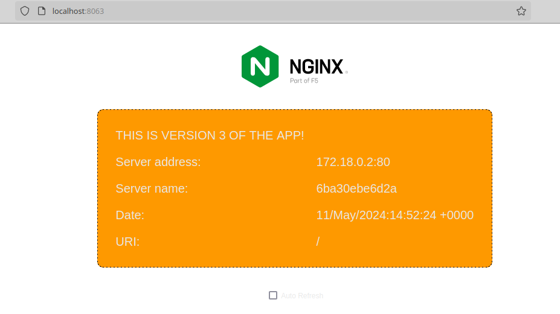

# Docker Compose in a nutshell

Docker Compose is a super cool tool that allows you to define and manage multi-container applications. You can run a project with with multiple containers from a single YAML file. With a single command, you can start and stop all your services.

Docker Compose relies on a YAML file to make its magic. This file is usually called `compose.yaml`. I've seen cases where it's called `docker-compose.yaml` too, but the preferred one, according to Docker official documents, is `compose.yaml`. This file lives in the workinf directory.

## The Compose application model

I read this in [Docker's official documentation on Compose](https://docs.docker.com/compose/compose-application-model/), and I loved how it's explained. These are the parts of a Docker Compose file.

> Computing components of an application are defined as **services**. Services communicate with each other through **networks**. Services store and share persistent data into **volumes**. Some services require configuration data that is dependent on the runtime or platform. This is defined as **configs**. A **secret** is for sensittive data that shouldn't be exposed.

The above are the main components of a Docker Compose file, that will define your deployment. To interact with your Compose application, you use the **Comppose CLI**.

# Installing Docker Compose

In the [Docker Docs on how to install Docker Compose](https://docs.docker.com/compose/install/linux/), they suggest 2 ways: using the apt repository (you need to add the repository to Apt) or doing it manually. I did it manually. The result was interesting. I installed it successfully, but the result was interesting. Let me show you.

To install it manually, these are the 4 commands you need to run.

```
DOCKER_CONFIG=${DOCKER_CONFIG:-$HOME/.docker}
mkdir -p $DOCKER_CONFIG/cli-plugins
curl -SL https://github.com/docker/compose/releases/download/v2.27.0/docker-compose-linux-x86_64 -o $DOCKER_CONFIG/cli-plugins/docker-compose
chmod +x $DOCKER_CONFIG/cli-plugins/docker-compose
```
The [latest version of Docker Compose is v2.27.0](https://github.com/docker/compose/releases), and it's the one specified in the command above. The result, however, was this one.


It installed version v2.20.3! Why?

# Composing with Docker Compose

To see Docker Compose in action, I built a very simple Docker Compose file. There are 3 services, that represent 3 different versions of that app from the previous article. That one had 2 versions. I created a third one for this experiment.

This is the Docker Compose file.

```yaml
name: theapp

services:
  app1:
    image: rmiravalles/theapp:v1
    ports:
      - "8061:80"
  app2:
    image: rmiravalles/theapp:v2
    ports:
      - "8062:80"
  app3:
    image: rmiravalles/theapp:v3
    ports:
      - "8063:80"
```

The command to run this file is `docker compose up`. The Docker Engine will build everything that's in the `compose.yaml`. In this case, the image is ready, and I just told Docker to go and fetch it from my Docker Hub. You can build an image from scratch, though, from an existing `Dockerfile`. For that, instead of the `image` parameter, you use `build`.

This will fire the containers based on the images indicated, and it will expose those ports indicated in the `ports` parameter. In this case, port 8061 for app1, 8062 for app2, and 8063 for app3.

When you run the `docker compose up` command, the output looks like this.


And here are the 3 apps running in their respective ports.




I spun up 3 application using a single YAML file, and that's powerful!

There's a lot more to Docker Compose, and I may dedicate an additional article or 2 to it, as I move along with my studies.

Thank you for staying with me until here!

Have a great weekend!


