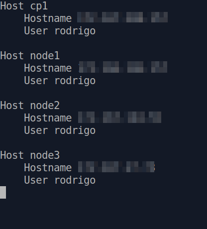

# Type less

Hello cloud world!

This is another short article.

I'm on the Kubernetes learning path, as you may know. This week I've experimented bootstrapping a cluster with kubeadm. This is part of [Pluralsight's](https://pluralsight.com/) Certified Kubernetes Administrator learning path. My current cluster has one control plane node and 3 worker nodes, and I've been experimenting with different `kubectl` commands. More on that later.

Today I just wanted to share an easier way to `ssh` into remote systems.

The command to `ssh` into a remote machine is as follows:

`ssh -p 22 user@server.com` or `ssh -p 22 user@192.168.1.2`

In the command above, `22` is the port number, `user` is the username, and the part that comer after the `@` can be either the hostname or the IP address of the remote server youwant to connect to.

# The SSH Config file

If you often need to `ssh` into different remote systems, instead of typing these commands, you can create aliases for the different systems you need to connect to. You do this by editing the `~/.ssh/config` file.

For these Kubernetes courses I'm taking, I have to connect to the different VMs running the nodes. To make my life a bit easier, I created aliases for the four hosts I'm using for the labs.

To edit the `~/.ssh/config` file, use your editor of choice to open it. I'm using *nano*.

`nano ~/.ssh/config`

Once inside the file, just add entries for the remote systems you access frequently. In my case, I added four systems. One is the control plane node, and the other three are the worker nodes.

It looks like this.



Each section starts with `Host`. This is the name you're going to use to connect to the remote server. Below that are the values you use to connect. No indentantion is actually needed, but it's good to use, for clarity.

Below is another example. 

```bash
Host hostname1
    Hostname server.com
    User johndoe
    Port 22

Host hostname2
    Hostname 192.168.1.2
    User johndoe
    Port 22
```
Now, if want to connect to my control plane node, I simply type this.

`ssh cp1`

>What I mentioned above works only for the current user. If you want to use these aliases system-wide, you need to edit the `/etc/ssh/ssh_config` file.

# Save time

This was a super short one. Whenever you can, try to save some time, and make your life a bit easier.

Soon I'll start sharing my Kubernetes learning journey here.

Before I leave, I just want to share my first musical note. This year, Bee Thousand, the incredibly amazing album from [Guided by Voices](https://www.guidedbyvoices.com/) turns 30. This is one of my favorite albums of all time. I was just listening to it today, and it still has the same impact on me.


**Listen to Guided By Voices!**


