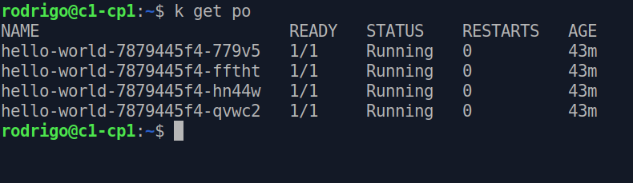
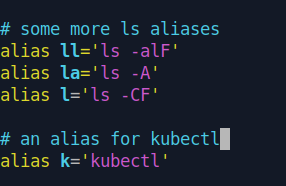

# Are we lazy?

Welcome to another tiny article!

I bet you've heard it many times. DevOps engineers are lazy, and that's why they develop all these automation tools.

Don't be lazy! But don't waste your time either!

# Save time and brain power

It took me some time to implement this one. I want to save time and energy, obviously, but I'm very forgetful. What a lame excuse, isn't it?

Anyway, you may be aware of *aliases* in Linux. It's a custom command that you set to execute another command, or a series of commands. The purpose of an alias is to be shorter and easier to type than the original command.

In Kubernetes, you get to type `kubectl` a lot. Mostly everybody who's working with Kubernetes on a regular basis has an alias configured for `kubectl`. In fact, it's something that everybody suggests you do it, if you sit for one of the Kubernetes certification exams. It will save you precious time, and brain power.

# k is for kubectl

This is the shortest alias you can get. It's more or less a convention, I guess, to use the letter `k` as an alias for `kubectl`. It makes sense, of course. I'm using the letter `k` too, but bear in mind that you could use any letter or word you want. Choose the one that you like and makes you happy.

You can set your alias directly in the shell, with the `alias` command. For our dear `k` standing for `kubectl`, it will look like this.

`alias k='kubectl'`

From now one, if you hit the `k`, the system will know that you mean `kubectl`.

# Make it persistant

The `alias` command will save your alias definition for as long as the shell session exists. Once it's terminated, it forgets the alias.

If you want to make it persist across sessions, you need to edit the `bashrc` file. Just add the same line anywhere in the file. Here I used *Vim* to do it. Yes, I finally started using *Vim* on a regular basis.

`vim ~/.bashrc`

Move down the lines with `J`, and find a cosy place for the following line: `alias k='kubectl'`. Ah, you need to hit `I` before entering any text in *Vim*. When you're done, hit the `Esc` button to go back to the normal mode. Now this is the part people joke about. How to exit *Vim*? To save your changes and close the file, type this: `:wq`. And you're out of *Vim*.

Above you can see how my `bashrc` file looks like, after adding this `k` alias. You can add other aliases there too. The `kubectl` auto completion is there too. Another super useful tool you must start using, if you aren't already. I'll write about in a future article.

# Autocompletion

I wasn't going to write about it today, but I must, after watching [Mischa Van der Burg's](https://mischavandenburg.substack.com/) Kubernetes course. I wasn't aware that the tab autocompletion didn't work with the `k` alias! For it to work, you need to add yet another line to your `bashrc` file. But first let's see how to get the tab autocompletion going

## Installing bash-completion

To install `bash-completion`, run the following.

`sudo apt install bash-completion`

## Editing the bashrc file

Once you have `bash-completion` installed, add this line to your `bashrc` file.

`source <(kubectl completion bash)`

From now on, you can simply start typing the first letters of a kubectl command and hit the Tab button. It will autocomplete the command for you, or it will suggest a number of possible commands to be used. It's super handy! But it doesn't work with just the `k` out of the box! For that, you need to add yet another line to the `bashrc` file. This is the one.

`complete -o default -F __start_kubectl k`

You may need to restart the shell for the change to take into effect.

Thank you Mischa!

Thank you for reading this far.

