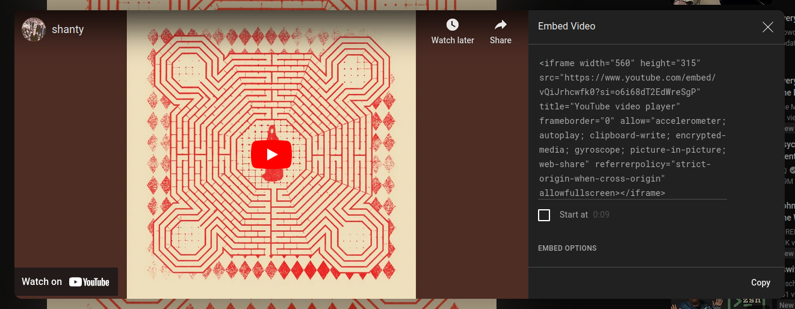

# Sharing YouTube videos in your Jekyll posts

Yesterday I published an article with an embedded YouTube video. It was a simple thing I learned, and I was very excited to try it.

I thought it's a good idea to share the process here. I'll always do my best to share what I learn, even if it's a small and simple thing. So let's go!

## Paste the iframe code

The fastest and simplest way to embed a video in your post is to simply copy and paste the iframe code directly in your Markdown post file.

This is a hawntingly beautiful song from [Slowdive's](https://slowdiveofficial.com/) latest album, Everything is Alive. They broke up in 1995 and spent many years without releasing any songs. This album is from 2023.

<iframe width="560" height="315" src="https://www.youtube.com/embed/vQiJrhcwfk0?si=ubYcIrjxUyW_L0TP" title="YouTube video player" frameborder="0" allow="accelerometer; autoplay; clipboard-write; encrypted-media; gyroscope; picture-in-picture; web-share" referrerpolicy="strict-origin-when-cross-origin" allowfullscreen></iframe>

To find this code, go to the YouTube video, click on *share*, then *embed*. This is what you'll see, and this is the code you should copy and paste into your article.



## Use an include file

To use this option, you need to set up a thing or two.

In your project's directory, you should already have a directory called `_includes`. If you don't, you need to create one. Don't forget the underscore!

Inside this `_includes` directory, you need to create a file called `youtube.html`. Put these lines of code in this file.

```html
<div class="embed-container">
    <iframe src="https://www.youtube.com/embed/{{ include.id }}" width="560" height="315" frameborder="0" allowfullscreen></iframe>
</div>
```

Now, when you want to embed a YouTube video in your Jekyll posts, instead of posting the entire iframe block, you simply paste the following.

```
    
```

Just replace `VIDEO_ID` with the video's ID. This is the sequence of characters that come after the `watch?v=` in the video's URL.

The video below uses this technique.



This is Mojave 3. After Slowdive broke up in 1995, they formed Mojave 3.

The code looks nicer this way. A single line instead of a few.

It's been years since I listened to Mojave 3. I'm feeling young again! :)
