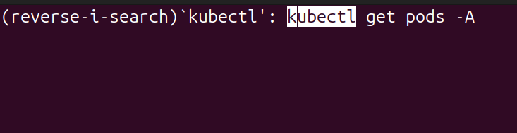

# Keep your hands on the keyboard at all times!

Hello, and welcome to another micro article. These are bits of useful information I gather here and there.

This one's about the GNU Readline.This is a library that, I guess, comes with every Linux distribution.You can see its contents if you search for the `inputrc` file in your system. Mine is in `/etc/inputrc`.

This is a library that provides powerful in-line editing capabilities when you're in your command line. You've been using it all the time. I wasn't aware that many of these ubiquitous shortcuts, like the **TAB autocompletion** were part of this library.

# Keyboard shortcuts

Some super useful shortcuts.

| Keystroke | Action |
| ----------- | ----------- |
| Ctrl+F | Go forward one character |
| Ctrl+B | Go backward one character |
| Alt+F | Go forward one word |
| Alt+B | Go backward one word |
| Ctrl+A | Go to the beginning of the current line |
| Ctrl+E | Go to the end of the current line |
| Ctrl+L | Clear the screen (the same as typing clear) |
| Ctrl+P | Move backwards in the command history (the same as the up arrow) |
| Ctrl+N | Move forward in the command history |

# Ctrl+R reverse search

Now this one is awesome!

The `Ctrl+R` will let you search for previous commands based on keywords. You type the keyword and it will show you the previous command you ran with that keyword. Hit `Ctrl+R` again and it will show you the previous one. Keep hitting `Ctrl+R` until you find the one you were looking for.

Here, I'm searching for a `kubectl` command I ran in the past.

# There's more, much more!

There's a lot more that I want to share, but I need to go now. I'll update this article very soon. I want to talk about *killing* and *yanking*! But now I really need to go.

See you soon!
