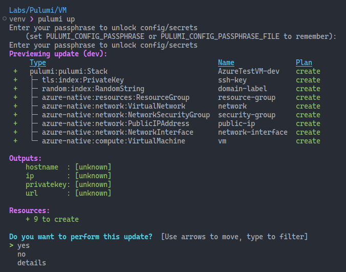
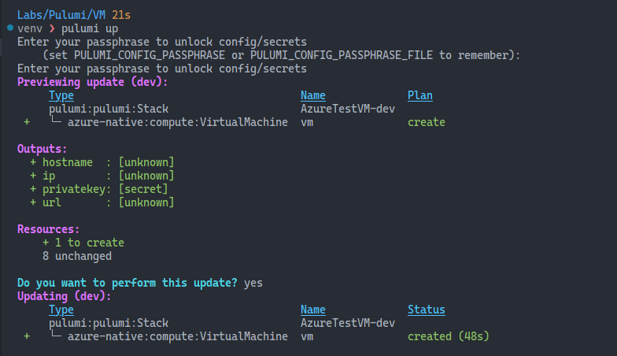
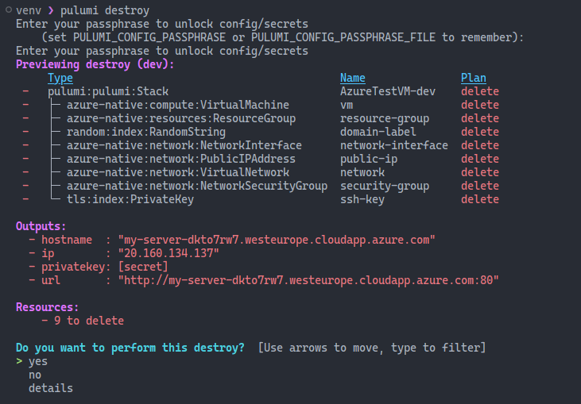

# Getting back to the blog

Hello! Welcome back to the blog. It's been too long since I last wrote here, far too long.

I've been busy with work and family life, but it doesn't exactly mean I don't have the time. I often struggle with finding the right subjects to write about. To be honest, it boils down to the imposter syndrome. It's all been said and done. I'm the least qualified out there to write anything about any subject. But you know what? Let's do it!

## What I've learned this week

I love the idea of having a weekly article where I can share what I've learned. I'll do my best to be consistent with this. For this week's article, I'll write a few lines about my first steps with **Pulumi**. Since I'm an Azure guy, I'll be using Azure as my cloud provider. For the programming language, I'll be using Python. I don't have a developer background, and Python is the only language I can understand. I can't say I'm fluent in it, but I believe I can order a cup of coffee and ask for directions in Python. :smile:

# What is Pulumi?

[Pulumi](https://www.pulumi.com/) is an open-source infrastructure as code (IaC) platform that allows you to define and manage cloud resources using familiar programming languages, like Python, and Go. This allows for a more seamless working experience, as you can leverage existing programming skills and tools to manage your infrastructure.
If you want to know more about Infrastructure as Code and its benefits, check out [this article](https://www.pulumi.com/what-is/what-is-infrastructure-as-code/).

# Getting the tools

To get started with Pulumi, you'll need to install the Pulumi CLI and the Azure CLI.

## Installing the Pulumi CLI

You can install the Pulumi CLI using this super simple command:

```bash
curl -fsSL https://get.pulumi.com | sh
```
To verify the installation, run the following:

```bash
pulumi version
```

## Installing the Azure CLI

The Azure CLI is a command-line tool that allows you to manage Azure resources. There's a super simple, one-line command, to install it. If you're on a Debian-based system, this is the command:

```bash
curl -sL https://aka.ms/InstallAzureCLIDeb | sudo bash
```

To verify the installation, run the following:

```bash
az version
```

## Installing Python

If you're on a Linux system, most likely you already have Python installed. To check if you have it, run the following command:

```bash
python3 --version
```

# The backend

The backend is the place where the state of your infrastructure is stored. This is a very important place, and it needs to be secure. Pulumi supports two classes of backends: **Pulumi Cloud** and **DIY**. The Pulumi Cloud backend is a managed service that stores your state in the Pulumi Cloud application. The Do-It-Yourself approach allows you to store your state in a variety of places, including local files, S3 buckets, and Azure Blob Storage. Since this is an Azure place, I'll be using Azure Blob Storage as my backend. We'll need a storage account and a container. This script did it for me:

```bash
#!/bin/bash

# This script creates a resource group, a storage account, and a blob container in Azure.

# set variables
rg=pulumilab-rg
location=westeurope
storage=pulumilabstorage
container=state

# create resource group
az group create -n $rg -l $location

# create storage account
az storage account create -n $storage -g $rg -l $location --sku Standard_LRS

# create blob container
az storage container create --name $container --account-name $storage
```

Now that we have the storage account and the container, we need to tell Pulumi to use it. To do this, we need to set two environment variables: `AZURE_STORAGE_ACCOUNT` and `AZURE_STORAGE_KEY`. The access key will be used to authenticate the access to the container. You can do this by running the following commands:

```bash
export AZURE_STORAGE_ACCOUNT=<storage-account-name>
export AZURE_STORAGE_KEY=$(az storage account keys list --account-name <storage-account-name> --query '[0].value' -o tsv)
```

Just bear in mind that this will set the environment variables for the current session.

To start using the container we just created as the backend, we need to run the following command:

```bash
pulumi login azblob://<container-name>
```

Alternatively, if you're running version 3.411 or higher of the Pulumi CLI, instead of the environment variables, you can run the following command:

```bash
pulumi login azblob://<storage-account-name>/<container-name>
```

This will create a folder called `.pulumi` in your container. This folder will contain the configuration for the backend.

# A basic Pulumi project

Now that we have the backend set up, let's create a basic Pulumi project. A project is simply a folder that contains the code and configuration for your infrastructure. To create a new project, we run the `pulumi new` command. This command will create all the necessary files and folders for a new project. You can choose from a variety of templates. To see the available templates, run the following command:

```bash
pulumi new --l | grep azure
```
This will show you all the available templates for Azure. For this experiment, I chose the `vm-azure-python` template, to create a virtual machine. To create the project, run the following command:

```bash
pulumi new azure-vm-python
```

When you run this command, Pulumi will prompt you to provide some configuration options for your new project. I just hit enter for all the options, with the plan to change them later.

I forgot to mention that you need to be logged in to Azure. To do this, run the `az login` command. This will open a browser window where you can log in to your Azure account.

I also forgot to mention that I created a new folder for the project. I called it `VM`. So, after running the `pulumi new` command inside this folder, I ended up with the following structure:

```
VM
├── Pulumi.yaml
|-- Pulumi.dev.yaml
├── __main__.py
├── __pycache__
├── requirements.txt
└── venv
```

The `Pulumi.yaml` file contains the configuration for the project. The `Pulumi.dev.yaml` file contains the configuration for the development environment. The `__main__.py` file contains the code for the project. The `requirements.txt` file contains the dependencies for the project. The `venv` folder contains the virtual environment for the project.

# The code

The code in the `__main__.py` file is the code that will be executed when you run the `pulumi up` command. It uses the Pulumi SDK to define the infrastructure. The Azure library used here is `pulumi_azure_native`. Pulumi recommends using it, instead of the `pulumi_azure` library.

I want do go through the code generated by the template, so we can understand it better together. I'll leave that for the next article, though.

# Pulumi up

To deploy the infrastructure, we need to run the `pulumi up` command. This command will show you a preview of the changes that will be made to your infrastructure. If you're happy with the changes, you can confirm them by moving your cursor to `yes`. This will create the resources in Azure.



## The results and the setbacks

I was met with a few errors when Pulumi tried to create the resources. The first one was related to the VM size I chose. I chose a size that didn't have available quotas in West Europe, the region I was using. It worked after I changed the size. This was a good learning experience, because I learned new commands to check the available sizes and quotas in Azure. To see the available sizes, run the following command:

```bash
az vm list-usage --location westeurope --output table
```

In the image below, you can see the result of the last `pulumi up` command. Only the VM was created this time, because the other resource had already been created in the previous run. This is a very important feature of IaC tools called **idempotency**. It means that if you run the same command multiple times, it will only create the resources that don't exist yet.



# Pulumi destroy

To delete the resources created by Pulumi, you can run the `pulumi destroy` command. This command will delete all the resources created by the project in the stack, but it won't destroy the stack itself. It sounds super scary, and aggressive! This command should be used with the utmost care. More on this later.



## This is only the beginning of my Pulumi journey

I'm dying to speak about the code in the files, but I think this article is long enough already. I'll leave that for the next article.

I always like to end an article with a bit of music. Here's the latest collaboration between Mark Pritchard and Thom Yorke. The video is nuts!



Thanks for reading!