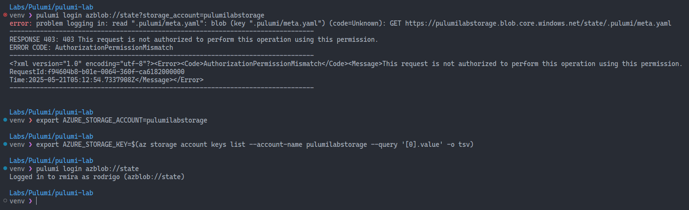
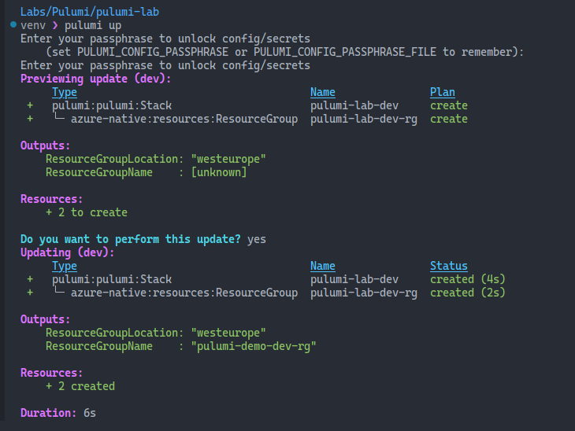
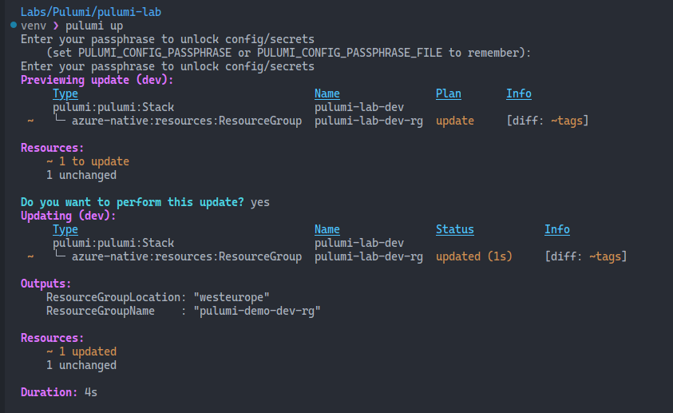
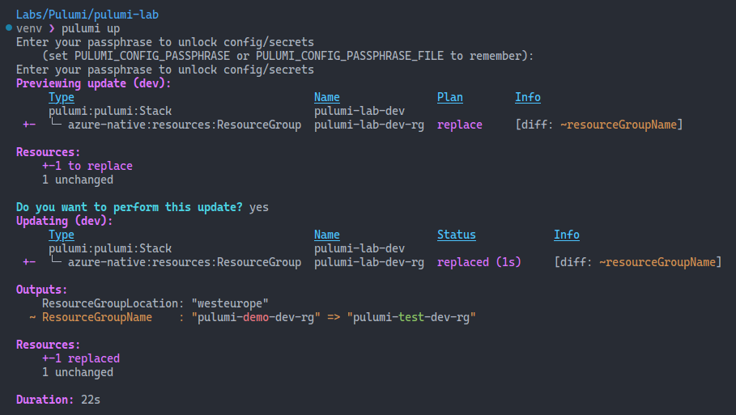
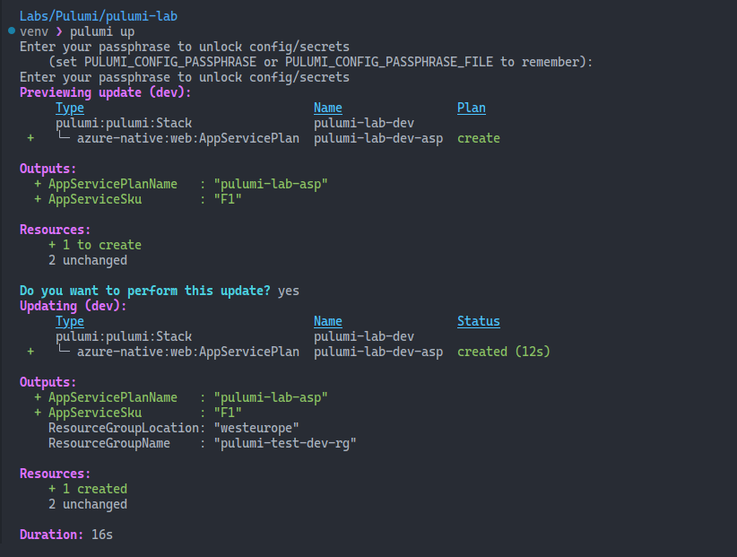
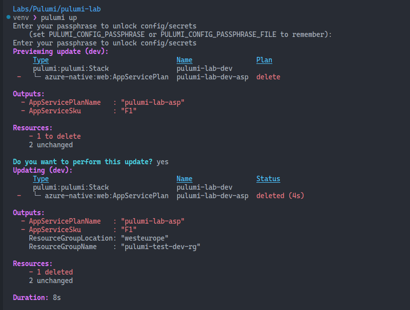

# More Pulumi fundamentals

Hello! I've been experimenting with [Pulumi](https://www.pulumi.com/) more and more, and I couldn't wait to share it here. These are only the first steps, but it's exciting! Learning is exciting!

If you're learning Pulumi, I highly recommend following [Alexandre Nédélec](https://techwatching.dev/). He has some great resources and tutorials that can help you get started. This article is inspired by his [Pulumi Azure Workshop](https://github.com/TechWatching/pulumi-azure-workshop). He's a [Puluminary](https://www.pulumi.com/community/puluminaries/), and puts out a lot of great content.

Check out this video where he shares his [learning roadmap for Pulumi](https://roadmap.sh/r/pulumi-roadmap). Absolutely worth reading and watching! Thank you, Alexandre!



# Creating a new project

## Logging in to Pulumi

We saw in the previous article how we can log in to Pulumi using a blob container as the backend. This involves setting up two environment variables: `AZURE_STORAGE_ACCOUNT` and `AZURE_STORAGE_KEY`. I also mentioned, and this was taken from the [official documentation](https://www.pulumi.com/docs/iac/concepts/state-and-backends/#azure-blob-storage), that you can simply run a single command, without the need to set up any environment variables. This didn't work for me. I'm most likely missing something, but I couldn't find much information out there.

According to the official documentation, this should be the way to do it, starting from Pulumi CLI version 3.41.1:

```bash
pulumi login azblob://<container-path>?storage_account=account_name
```

In my case, that the container is called `state`, and the storage account is called `pulumilabstorage`, I assumed the command would look like this:

```bash
pulumi login azblob://state?storage_account=pulumilabstorage
```

I got a permission denied error (see the image below), even though I'm the owner of everything. With the environment variables, though, it worked. Something to be investigated. Any ideas?



## Pulumi new

In the previous article, I used one of the many available templates to create a new project. We saw how we can list the available templates using the `pulumi new --l` command. Now, let's create an empty project with the `pulumi new` command and a few options.

```bash
pulumi new python -n pulumi-lab -s dev -d "a simple project to get started with Pulumi"
```

This command will create a new project called `pulumi-lab`, along with some files, using the Python language, and the dev stack. The `-d` option is used to provide a description for the project.

## The project structure

We saw this in the previous article, but let's take a look at the project structure again. The `pulumi new` command created a few files and folders for us:

```bash
pulumi-lab
├── Pulumi.dev.yaml
├── Pulumi.yaml
├── __init__.py
├── main.py
├── requirements.txt
└── venv
```

This is a good opportunity to take another look at what these files are for.

- `Pulumi.dev.yaml`: This file contains the configuration for the dev stack. It includes the configuration values for the resources that will be created in this stack.
- `Pulumi.yaml`: This file contains the configuration for the project. It includes the project name, description, and other metadata. You shouldn't need to change this file unless you want to change the project name or description.
- `__init__.py`: This file is used to mark the directory as a Python package. It can be empty, but it's required for Python packages.
- `main.py`: This is the main file where the code for the project will be written. It contains the logic for creating and managing the resources.
- `requirements.txt`: The list of dependencies for the project. It includes the packages that will be installed in the virtual environment.
- `venv`: The virtual environment created for the project. It contains the Python interpreter and the packages installed for the project.

# Stacks

This is a basic concept in Pulumi. A stack is a named, isolated instance of a Pulumi program. It contains the resources created by the program and their state. Each stack has its own configuration and state, which allows you to create multiple environments (e.g., dev, staging, production) using the same code. In my case, since I'm using Azure Blob Storage as the backend, each stack will have its own entry.

## Creating a new stack

The `pulumi new` command created a new stack called `dev` for us. We can create a new stack using the `pulumi stack init` command. This command takes the name of the stack as an argument. For example, to create a new stack called `prod`, we can run the following command:

```bash
pulumi stack init prod
```

To switch between stacks, we can use `pulumi stack select`. To move into the `prod` stack, we can run the following command:

```bash
pulumi stack select prod
```

## My dev stack

My `dev` stack looks like this:

```yaml
config:
  config:
  pulumi-lab:AppServiceSku: F1
  azure-native:location: westeurope
```

Very simple, just to get started and demonstrate how it works. I defined the region using this command:

```bash
pulumi config set azure-native:location westeurope
```

This command sets the location for the resources that will be created in this stack, so you don't need to specify them in the code.

These values are going to be used in the main Python file to create the resources. We'll get to that now.

# The main Python file

The `main.py` file is where the action happens.

```python
"""A Python Pulumi program"""

import pulumi
from pulumi import Config
import pulumi_azure_native as azure_native

# Get the current stack name
stack = pulumi.get_stack()

# Create a new configuration object
config = Config()

# Get the values from the configuration
app_service_sku = config.get("AppServiceSku")

# Create a resource group
resource_group = azure_native.resources.ResourceGroup(
    f"pulumi-lab-{stack}-rg",
    resource_group_name=f"pulumi-demo-{stack}-rg",
    tags={
        "Environment": "Dev",
        "Project": "Pulumi Lab",
        "ProvisionedBy": "Pulumi",
    },
)

# Export the resource group name and location
pulumi.export("ResourceGroupName", resource_group.name)
pulumi.export("ResourceGroupLocation", resource_group.location)
```

## Breaking it down

```Python
import pulumi
from pulumi import Config
import pulumi_azure_native as azure_native
```

Here we're importing the necessary modules for the project. Let's break it down:
- `pulumi`: The main Pulumi module. It contains the core functionality for creating and managing resources.
- `Config`: A class that allows you to manage configuration values for the project. It allows you to get and set configuration values.
- `pulumi_azure_native`: The Azure Native provider for Pulumi. It contains the classes and functions for creating and managing Azure resources.

```Python
# Get the current stack name
stack = pulumi.get_stack()
```

This line calls the `get_stack()` function from the Pulumi SDK to get the name of the currently active stack and assigns it to the `stack` variable. This variable can then be used to create unique resource names.

```Python
# Create a new configuration object
config = Config()
```

This line of code creates an instance of the `Config` class, which is part of Pulumi's core library. The `Config` class is used to manage configuration values for the stack. The `Config` object acts as a container for key-value pairs that define environment-specific settings.

```Python
# Get the values from the configuration
app_service_sku = config.get("AppServiceSku")
```

This line gets the value of the `AppServiceSku`, defined in the `Pulumi.dev.yaml` file. If the value is not set, it will return `None`. You can also use `config.require("AppServiceSku")` to require the value to be set, and it will raise an error if it's not set.

Another method that can be used is `config.get_secret("AppServiceSku")`, which will return the value as a secret. This is useful for sensitive values, such as passwords or API keys. This will encrypt the value and store it in the Pulumi state file.

```Python
# Create a resource group
resource_group = azure_native.resources.ResourceGroup(
    f"pulumi-lab-{stack}-rg",
    resource_group_name=f"pulumi-demo-{stack}-rg",
    tags={
        "Environment": "Dev",
        "Project": "Pulumi Lab",
        "ProvisionedBy": "Pulumi",
    },
)
```

This line creates a new resource group using the `ResourceGroup` class from the Azure Native provider. The parameters are:
- `f"pulumi-lab-{stack}-rg"`: The name of the resource group. This is a unique name for the resource group, and it includes the stack name to make it unique. This is NOT the actual name of the resource group, but a unique name for the resource in Pulumi.
- `resource_group_name=f"pulumi-demo-{stack}-rg"`: The name of the resource group. This is the name that you will see in Azure.
- `tags`: A dictionary of tags to apply to the resource group. Tags are key-value pairs that can be used to organize and manage resources in Azure.

Note here that I didn't use the `location` parameter. This is because I set the location in the `Pulumi.dev.yaml` file. If you want to override the location, you can do it here by adding the `location` parameter.

```Python
# Export the resource group name and location
pulumi.export("ResourceGroupName", resource_group.name)
pulumi.export("ResourceGroupLocation", resource_group.location)
```
This line exports the resource group name and location. This allows you to see the values in the Pulumi console and use them in other parts of the program. The `pulumi.export` function takes two arguments: the name of the export and the value to export.
The name of the export is used to identify the value in the Pulumi console, and the value is the value to export.

# Pulumi up

Now that we have our project set up, we run `pulumi up` to create the resources. Note that the name of the resource group will be know only after the resource is created.



## An update

Here's a small update to the resource group. I added a new tag to it.

```Python
# Create a resource group
resource_group = azure_native.resources.ResourceGroup(
    f"pulumi-lab-{stack}-rg",
    resource_group_name=f"pulumi-demo-{stack}-rg",
    tags={
        "Author": "Rodrigo",
        "Environment": "Dev",
        "Project": "Pulumi Lab",
        "ProvisionedBy": "Pulumi",
    },
)
```

When I run `pulumi up` now, it says an update will be performed, and it also tells me what is the difference between the current state and the new state.



## A radical change

Now let's perform a radical change. Let's rename the resource group. Pulumi will have to destroy the old resource group and create a new one, because we can't change the name of an existing resource group. The plan here is called `replace`.

```Python
# Create a resource group
resource_group = azure_native.resources.ResourceGroup(
    f"pulumi-lab-{stack}-rg",
    resource_group_name=f"pulumi-test-{stack}-rg",
    tags={
        "Author": "Rodrigo",
        "Environment": "Dev",
        "Project": "Pulumi Lab",
        "ProvisionedBy": "Pulumi",
    },
)
```



## Adding a new resource

Now let's add an App Service Plan to the project. For this, we'll finally use the `app_service_sku` variable we defined earlier. This will allow us to set the SKU of the App Service Plan using the configuration value we set in the `Pulumi.dev.yaml` file.

```python
# Create an App Service Plan
app_service_plan = azure_native.web.AppServicePlan(
    f"pulumi-lab-{stack}-asp",
    resource_group_name=resource_group.name,
    name="pulumi-lab-asp",
    sku=azure_native.web.SkuDescriptionArgs(
        name=app_service_sku,
    ),
    kind="Linux",
    tags={
        "Environment": "Dev",
        "Project": "Pulumi Lab",
        "ProvisionedBy": "Pulumi",
    },
)
```

This code creates an App Service Plan using the `AppServicePlan` class from the Azure Native provider. The `SkuDescriptionArgs` is another class, used to define the SKU of the App Service Plan.

Let's also add two more exports to the code, so we can see the name of the App Service Plan and its SKU in the Pulumi console.

```python
pulumi.export("AppServiceSku", app_service_sku)
pulumi.export("AppServicePlanName", app_service_plan.name)
```

Now when we run `pulumi up`, only the new resource will be created. As you know, because it's idempotent, Pulumi will only create the new resource, and won't touch the existing ones.



## Removing a resource

Now let's remove the App Service Plan from the code. When we run `pulumi up`, Pulumi will detect that the resource is no longer in the code, and will remove it from the state. This is a `delete` operation. Don't forget to remove the exports as well, otherwise you'll get an error when you run `pulumi up`.



If you're going to manage your infrastructure with Pulumi, or any other IaC, you won't be using the `destroy` command too often, or ever. By simply removing the resource from the code, it will be removed from the state.

# To wrap up

This is another step in my learning journey with Pulumi. I'm enjoying it a lot. I even enrolled in their [Platform Engineering Workshop](https://info.pulumi.com/platform-engineering-workshop-series-intermediate?utm_campaign=11080757-FY2025Q4_Platform-Engineering-workshop-series&utm_content=332717131&utm_medium=social&utm_source=linkedin&hss_channel=lcp-18103664). I'm learning a lot!

Pulumi is growing fast, and I love how they've built a great community around it. I hope to become more proficient with it. Expect more content about Pulumi here in the future.

And lastly, I want to thank Alexandre Nédélec for his great content and inspiration.

Here's some music to wrap up this article. This is Lemonheads, with a new song. I've been a fan for many, many years. This song features J. Mascis in the guitar!



Thanks for reading!
